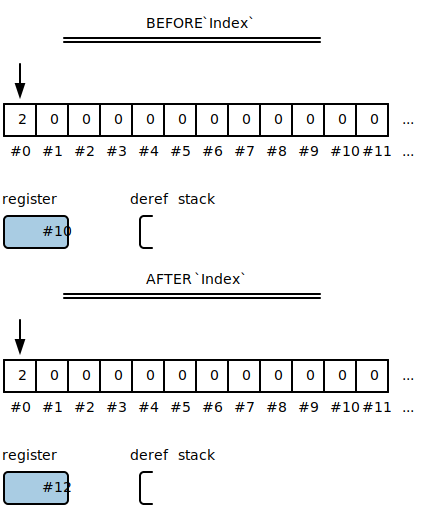
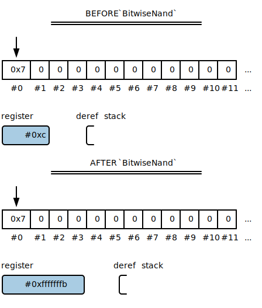

# The Core Instructions In Depth

First, the anatomy of the virtual machine:

The machine is composed of 4 components: a static array of cells (a turing tape), a pointer (the turing tape head), a register (a single cell), and a "dereference" stack (a stack of addresses used to keep track of the tape head's changing position).

User input should be encoded through the interface I/O (used with `Get` and `Put`) attached to the virtual machine.

## Memory

These are the instructions used for manipulating the turing tape.

#### Move

The `Move` instruction takes a constant integer as an argument: the number of cells to move the pointer. The number of cells can be either positive or negative.

#### Index

The `Index` instruction moves the register's value as a pointer by the value pointed to on the tape. For any N stored on the tape under the pointer, the address stored in the register will move by N cells. If N is negative, it will move the pointer in the register N cells to the left. If N is positive, the pointer will move to the right.

This is to account for the fact that the virtual machine is abstracted over pointers. Pointers, under the hood, are varying distances apart for different implementations. For implementations using an indexed array as a tape, the "address" of each cell is the previous address plus one. For implementations using **real pointers**, this difference can be 2, 4, 8 or who knows what: it depends on the implementation. So, to write code that uses pointers *without understanding how they work*, we need the `Index` instruction along with `Where?`, `Deref`, and `Refer`.

#### BitwiseNand

`BitwiseNand` performs a bitwise-NAND operation on the register and the tape, and stores the result in the register. This should perform a bitwise-NAND across all the bits which represent the cell, or the maximum integer size of the machine (usually 32 or 64 bits). Variation in this configuration *will* affect the runtime of programs. If a compiler is going to target a specific configuration of this parameter, it should be known to the compiler. I am considering implementing bitwise operations in a more canonical way, or enforcing that the program state all of the required configuration parameters.

#### Where?

`Where?` sets the register equal to the current value of the pointer: `register = ptr`. You might think this instruction is useless, because wouldn't the compiler always know where the pointer is? There's a nuanced reason for this instruction: it helps maximize portability.

Consider an implementation that uses *actual pointers* to implement the turing tape. In this case, incrementing and decrementing the value of the pointer ***will not be portable***. This is due to the fact that cell sizes vary from target to target.

*Instead*, to increment a pointer, the `Where?` instruction can be used. First, `Deref` the pointer. Then, `Move` one cell to the right. Finally, `Where?` stores the address of the current cell in the register.

#### Deref and Refer

The `Deref` instruction saves the current pointer to the "deref stack", and *dereferences* the address stored at the pointer: `push(ptr); ptr = *ptr`. The `Refer` undoes the last `Deref` instruction. It pops the top pointer off the deref stack, and stores it in the pointer: `ptr = pop()`.

 

## Arithmetic

These are the operators used for any math relation functionality.

#### IsNonNegative?

`IsNonNegative?` is the only operator for comparisons. It sets the register equal to 1 if the register is non-negative, 0 otherwise: `register = register >= 0? 1 : 0`.

#### Math

Each of the arithmetic operators function identically. For addition: `register += *ptr`. For subtraction: `register -= *ptr`. Very straightforward. Division (and remainder) by zero should halt the machine.

##### Add and Subtract

 

##### Multiply and Divide

 

##### Remainder

## Control

These instructions are used to control the flow of the program.

#### While, If, and Else

The `While` instruction creates a while-the-register-is-not-zero-loop over the block of code terminated by the matching `End` instruction: `while (register != 0) {`.

The `If` instruction functions similarly: it creates an if statement which can have an optional `Else` instruction. If statements are structured either: `If` ... `End`, or `If` ... `Else` ... `End`.

#### Function, Call, and Return

The `Function` instruction declares a function, and is terminated with a matching `End` block. Instructions inbetween the `Function` and `End` block are the function's body. The body of the function is only executed when the function is called.

The `Call` instruction calls the `register`th defined function in the program. If the register is 0, it will call the first function defined in the program. Calling on negative values halts the machine. Whenever the called function returns, it resumes execution where it was called.

The `Return` instruction makes the current function return early. Outside of a function body, this causes the program to terminate.

## Fundamental

These are the most basic, simplest, general purpose instructions.

#### Set

The `Set` instruction takes a constant integer argument, and sets the register to that value.

#### Save and Restore

The `Save` instruction writes the value of the register to the cell at the pointer: `*ptr = register`. The `Restore` instruction is the inverse: `register = *ptr`.

 

#### Get and Put

The `Get` instruction receives a value from the interface I/O device, and stores it in the register. The `Put` instruction sends the value of the register to the interface I/O device.

#### End

The `End` instruction has no use on its own: its only purpose is to serve as a matching instruction for the `While`, `If`, `Else`, and `Function` instructions.
