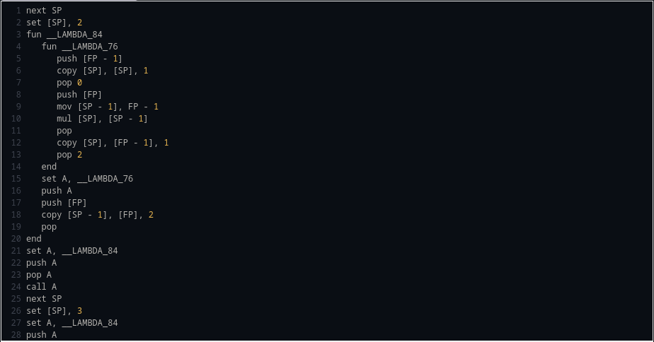
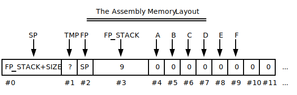
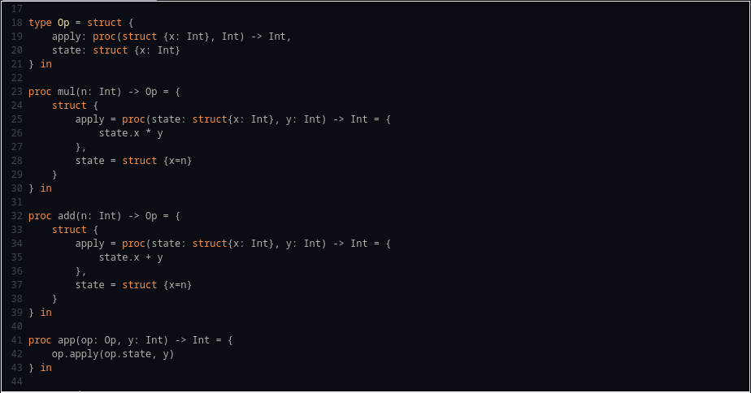

<div align="center">
  <h1>🌿🌱<b>Sage</b>🪴🍃</h1>
  <p>
    <strong>Sage advice for your coding conundrums!</strong>
  </p>
  <p float="left">
    
    <a href="https://adam-mcdaniel.net/sage"></a>
  </p>
</div>

[***Here's a link to the online compiler playground!***](https://adam-mcdaniel.net/sage)

## Table of Contents

- [What is Sage?](#what-is-sage)
- [Why Sage?](#why-sage)
- [How useful is Sage?](#how-useful-is-sage)
- [How do I use Sage?](#how-do-i-use-sage)
- [What does Sage look like?](#what-does-sage-look-like)
- [Feature Roadmap](#feature-roadmap)
- [Where can I learn more?](#where-can-i-learn-more)
- [How do I contribute?](#how-do-i-contribute)

## What is Sage?

Sage is a programming language that tries to be maximally portable, expressive, and intuitive. It borrows some aspects of Rust, C, and Python. It currently has an x86 compiler backend, a C source backend, and an interpreter backend [which can run on the web](https://adam-mcdaniel.net/sage).

<div align="center">
  <p float="left">
    
    
    
  </p>
</div>

Sage is licensed under the [MIT License](LICENSE).

## Why Sage?

Sage is very portable -- run it on your thermostat! Here's the complete list of core virtual machine instructions, and their C equivalents:

| Instruction | C Equivalent    |
| ----------- | --------------- |
| `while`     | `while (reg) {` |
| `if`        | `if (reg) {`    |
| `else`      | `} else {`      |
| `end`       | `}`             |
| `set N`     | `reg = N;`      |
| `call`      | `funs[reg]();`  |
| `ret`       | `return;`       |
| `save`      | `*tape_ptr = reg;` |
| `res`       | `reg = *tape_ptr;` |
| `move N`    | `tape_ptr += N;`   |
| `where`     | `reg = tape_ptr;`   |
| `deref`     | `push(tape_ptr); tape_ptr = *tape_ptr;` |
| `refer`     | `tape_ptr = pop();` |
| `index`     | `reg = (cell*)(reg) + *tape_ptr;`    |
| `add`       | `reg += *tape_ptr;` |
| `sub`       | `reg -= *tape_ptr;` |
| `mul`       | `reg *= *tape_ptr;` |
| `div`       | `reg /= *tape_ptr;` |
| `rem`       | `reg %= *tape_ptr;` |
| `gez`       | `reg = reg >= 0;`  |

The compiler can target this limited instruction "core" set, with an expanded "standard" instruction set for floating point operations and foreign functions. The core instruction set is designed to be as simple as possible for anyone to implement their own backend. [Try to see if you can implement it yourself for your backend of choice!](https://github.com/adam-mcdaniel/sage/blob/main/src/targets/c.rs)

The core instruction set is a "zero address code" IR, unlike the popular ["three address code"](https://en.wikipedia.org/wiki/Three-address_code) LLVM IR, but it's still possible to apply single static assignment to it. This makes the instruction set capable of applying LLVM's optimizations while being simple to implement.

This project is based on some ideas I had while working on [Harbor](https://github.com/adam-mcdaniel/harbor) for a hackathon.

## How useful is Sage?

Sage is a very young project, and is not ready for production. It's still possible to write very useful programs in it, though.

[SageOS is an operating system with a userspace written in Sage.](https://github.com/adam-mcdaniel/sage-os) Its graphical shell and presentation app (both written in Sage) use the FFI to draw to the screen, receive input from the mouse and keyboard, and interact with the filesystem. [You can look at the shell code here.](https://github.com/adam-mcdaniel/sage/tree/main/examples/sage-os/shell.sg)


The presentation app parses PPM image files from the filesystem and renders them to the screen. [You can look at the presentation code here](https://github.com/adam-mcdaniel/sage/tree/main/examples/sage-os/presentation.sg)


Go to the [web-demo](https://adam-mcdaniel.net/sage) or the [examples/frontend](https://github.com/adam-mcdaniel/sage/tree/main/examples/) folder to see more code examples.

## How do I use Sage?

To start using sage, install it with cargo:

```sh
$ cargo install --git https://github.com/adam-mcdaniel/sage
```

Then, you can run a sage file with the `sage` command:

```sh
$ sage examples/frontend/interactive-calculator.sg
```

You can also compile a sage file to C with the `--target` flag:

```sh
$ sage examples/frontend/interactive-calculator.sg --target c
$ # Or `-t c` for short
$ sage examples/frontend/interactive-calculator.sg -tc
$ gcc out.c -o out
$ ./out
```

## What does Sage look like?

Here's an example of a linked list in Sage:

<!--  -->


Here's an example of Sage's structural typing:

<!--  -->


Here's an example of Sage's pattern matching:


## Feature Roadmap

- [x] Compiler Backends
  - [x] x86 (semi-implemented and unoptimized)
  - [ ] RISC-V
  - [ ] ARM
  - [ ] LLVM (highly desired!)
  - [x] C (fully-implemented but unoptimized)
  - [x] Interpreter (fully-implemented but unoptimized)
  - [x] Web Backend
    - [x] Interpreter
    - [ ] Visual demo like the [web-demo](https://adam-mcdaniel.net/harbor) for [Harbor](https://github.com/adam-mcdaniel/harbor)
- [x] Static variables and constant expressions
- [x] Conditional compilation
- [x] Polymorphic functions
- [x] Mutability checks
- [x] Rust-like `enum`s
- [x] Pattern `match`ing
- [x] Structural typing
- [x] Recursive polymorphic types
- [ ] Iterators and list/vector/array comprehensions
- [ ] Hindley-Milner type inference
- [ ] Typeclasses
- [ ] Modules
- [ ] A standard library
  - [ ] Collections
  - [ ] Networking
  - [ ] Filesystem
  - [ ] Graphics
  - [ ] Audio
  - [ ] GUI
  - [ ] WebAssembly
  - [ ] Foreign Function Interface
  - [ ] Memory Management
- [ ] Better frontend parser (switch to [Nom](https://crates.io/crates/nom)?)
- [ ] A package manager
- [ ] AST Macros

## Where can I learn more?

You can read [my blog post](https://adam-mcdaniel-blog.github.io/compilers-for-the-future) (~20 minute read) about the programming language to learn more about the implementation!

## How do I contribute?

If you want to contribute, you can open an issue or a pull request. [Adding backends for other architectures is a great way to contribute!](https://github.com/adam-mcdaniel/sage/blob/main/src/targets/c.rs)

<!-- Do the same table, but divided into 2 columns to be easier to read -->
<!-- 
| Instruction | C Equivalent    | Instruction | C Equivalent    |
|:----------- |---------------|:----------- |:---------------|
| `while`     | `while (reg) {` | `where`     | `reg = tape_ptr;`   |
| `if`        | `if (reg) {`    | `deref`     | `push(tape_ptr); tape_ptr = *tape_ptr;` |
| `else`      | `} else {`      | `refer`     | `tape_ptr = pop();` |
| `end`       | `}`             | `index`     | `reg = (cell*)(reg) + *tape_ptr;`    |
| `set N`     | `reg = N;`      | `add`       | `reg += *tape_ptr;` |
| `call`      | `funs[reg]();`  | `sub`       | `reg -= *tape_ptr;` |
| `ret`       | `return;`       | `mul`       | `reg *= *tape_ptr;` |
| `save`      | `*tape_ptr = reg;` | `div`       | `reg /= *tape_ptr;` |
| `res`       | `reg = *tape_ptr;` | `rem`       | `reg %= *tape_ptr;` |
| `move N`    | `tape_ptr += N;`   | `gez`       | `reg = reg >= 0;`  | -->


<!--
Sage is a programming language with a low level virtual machine based on a Turing tape. The sage virtual machine has a read/write head and a single register. The read/write head moves around the tape, and uses the register as an accumulator. All worldly input is done through a single instruction, and all worldly output is done through a single instruction. Functionality which cannot be achieved with any algorithm, such as using an operating system's system calls to write to persistent memory, is also done through two instructions: one for sending values to the virtual machine's foreign function interface, and one for receiving. The goal of the virtual machine is to allow algorithms to be expressed in the same time complexity as they would on x86, but with the smallest possible number of instructions. This allows sage code to be *maximally* portable: [sage's core instruction set](./CORE.md) could be implemented in hardware much easier than any modern architecture due to its very small pool of opcodes and their simplicity.

## The Compiler Caveat

Compilers are one of the most useful tools ever made. They allow us to abstract our algorithms *way* beyond what computers are natively capable of understanding. For compilers to work, though, *they must be able to describe these high level concepts in terms native to the hardware*. This is a **big** problem: each computer is typically very different from the next. Thermostats, desktop computers, phones, and other systems typically all function differently.

## Enter: Intermediate Representations

Here's where LLVM and similar projects come in. LLVM is a great tool for writing compilers because it ***drastically*** simplifies this problem. Instead of writing a compiler for each different system's hardware, you can just write it to compile to LLVM! LLVM will do the heavy lifting and handle dealing with the specific hardware you want to compile to.

<div align="center">

</div>
</br>

This way, a compiler never has to understand the hardware it compiles to.

## The Intermediate Issues

So, if LLVM can do all this already, *why implement an alternative to do the same thing?* Well, there are a few reasons:

1. Most compiler backends are complex.

If you've ever looked at LLVM, you know that it would be a difficult task to implement LLVM for another target. Much simpler than a C compiler for a target platform, but still complex.

2. System calls are not portable.

System calls are a ***huge*** problem in terms of portability in assembly languages. The way you write some data to an output device is different from platform to platform, and *even worse*, these methods of I/O are ***side-effecting***. *Even if* you can manage to write a character to an output device, every platform's "write" system call likely has different side-effects on the state of the program. ***This is poisonous to portable code***. Communicating with the environment is different from platform to platform, and affects program state in nonuniform ways.

3. Unsupported instructions.

Inevitably, there are going to be instructions in many intermediate representations that can't be compiled to every architecture. This isn't necessarily a problem with *the IR*, its just a side-effect of how IRs typically support complex instructions for their frontends' to take advantage of. An unfortunate consequence is just that certain programs using this IR aren't universally portable. This is truly unavoidable, but it should be minimized.

## A Smaller Solution

In order to solve some of these problems, [I've created another virtual machine](https://xkcd.com/927/) with the following ideals:

1. The instruction set must be able to implement algorithms in a reasonable time complexity. [Addition should ***not*** be O(n)](https://esolangs.org/wiki/Brainfuck_algorithms#x_.3D_x_.2B_y).
2. The instruction set must be **small**. This is to minimize the effort to implement another target for the instruction set.
3. Each instruction must take *at most* one integer argument ***known at compile time***. This is to simplify the individual instructions themselves, which makes optimizations easier.
4. The instruction set must be *agnostic to the concept of bit-width*. Casting between different data types in the virtual machine ***immediately*** increases the complexity of the instruction set: you need different instructions for different types. All data should be represented as a `Cell`, a place to store a single unit of data (typically the largest int size supported by the platform).
5. The instruction set must be able to implement abstractions like functions, pointers, and compound data types.
6. ***Interacting with the environment (the outside world) should not change the state of anything but the register***. 

#### Examples

The instruction set is composed of two halves of 24 instructions each: [the "Core", canonical instructions](CORE.md#the-core-instructions-in-depth), and the "Standard" instructions. Here are some example below demonstrating the language. There are others in the examples folder.

- [AES](examples/vm/aes.vm.sg)
- [Calculator](examples/vm/calculator.vm.sg)
- [Factorial](examples/vm/factorial.vm.sg)
- [Cat](examples/vm/cat.vm.sg)

## The Assembly Language

[***Click here to see the documentation!***](https://adam-mcdaniel.github.io/sage/sage/asm/)



While the virtual machine itself is meant to be as small as possible, the stages of IR built on top of it are meant to be as high level as possible. The assembly language has many instructions: *there are seven different instructions for comparisons!!*

The assembly language is also split into two halves as well: one built on the pure, Core variant, and the other built on the Standard variant. This way, programs can be compiled for maximum portability, but use standard instructions if necessary as a fallback.


### Conventions

Here is the memory layout the assembly language uses on the turing tape.

<div align="center">

</div>
</br>

The `FP_STACK` is a pointer to a separate stack than the `SP`: the `FP_STACK` begins directly after the `F` register (when there are no items on the `FP_STACK`, it points to `F`). The size of the `FP_STACK` is provided to the assembler at compile time. The size of the `FP_STACK` determines the number of recursive calls the program may make before the frame pointer stack overflows.

In the assembly language, there are a few arbitrary conventions.
1. The stack pointer always points to the top item on the stack (if you push a tuple of `(1, 2, 3)`, the stack pointer will point to the `3`).
2. The frame pointer is equal to the top of the stack when the current function was called. When the program first starts, and no function has been called, the frame pointer is equal to the stack pointer.
3. Function calls push their frame pointers to a private stack *invisible* to the user. **You cannot use the `FP_STACK` register**, which manages this stack.
4. You can push your arguments however you like. In the IR, the arguments are pushed in the order they're given to the function: `f(1, 2, 3)` pushes `1` first, `2` second, and `3` last.
5. Functions return values by popping the function arguments off of the stack, and pushing the return value. There's no need to worry about overwriting the saved frame pointer, because they're stored in a separate stack.

The assembly instructions always take arguments of: constant integers known at compile time, or values of type `Location`. A `Location` can either be a fixed address (registers), a dereferenced `Location`, or a `Location` offset by some cells. The `Location` `[SP + 4]`, for example, dereferences `SP` and moves four cells to the right (`SP.deref().offset(4)`).

#### Examples

- [Factorial](examples/asm/fact.asm.sg)
- [Cat](examples/asm/cat.asm.sg)
- [Comparisons](examples/asm/comparison.asm.sg)

## The Lower Intermediate Representation

[***Click here to see the documentation!***](https://adam-mcdaniel.github.io/sage/sage/lir/)



The lower intermediate representation is the type-checked layer of the compiler; all of the intermediate representations constructed on top of this layer are expressed in terms of LIR code before type-checking. LIR is high level enough to be *decently* human readable and usable. It's a bit more terse than C, but not by much. The type system is very expressive, and allows for unions, enums, procedures (as values), structures, arrays, and anonymous recursive types.

Here's an example of an anynomous recursive type implementing a linked list which can be typed-checked and compiled to the virtual machine:

```rs
const putint = proc(i: Int) -> None = std {
    put-int [SP]
    pop
} in

type List = let B = let T = Int in (T, &B) in B in

let x = (3, Null),
    y = (2, &x),
    z: (let A = (Int, &A) in A) = (1, &y),
    w: List = (0, &z)
    in putint(w.1->1->1->0)
```

[***Click here to use the interactive compiler online!***](https://adam-mcdaniel.net/sage)

#### Examples

- [128, 192, and 256 bit AES encryption and decryption](examples/lir/AES.lir.sg)
- [Quicksort](examples/lir/quicksort.lir.sg)
- [Factorial](examples/lir/fact.lir.sg)
- [Mutually Recursive Types](examples/lir/recursive-types.lir.sg)
- [Tagged Union](examples/lir/option.lir.sg)
- [Units](examples/lir/units.lir.sg)
- [Inline Assembly](examples/lir/inline-assembly.lir.sg)
- [Simulating Variable Capturing Functions](examples/lir/lambda-sim.lir.sg)

## The Sage Frontend

🚧 🏗️ ⚠️ This is under construction! ⚠️ 🏗️ 🚧

Here are examples of the current state of the frontend for Sage.

- [128, 192, and 256 bit AES encryption and decryption](examples/frontend/AES.sg)
- [A Calculator (Parser and Evaluator)](examples/frontend/calculator.sg)
- [Tree and List Enums (Generics)](examples/frontend/trees.sg)
- [Allocator](examples/frontend/allocator.sg)
-->