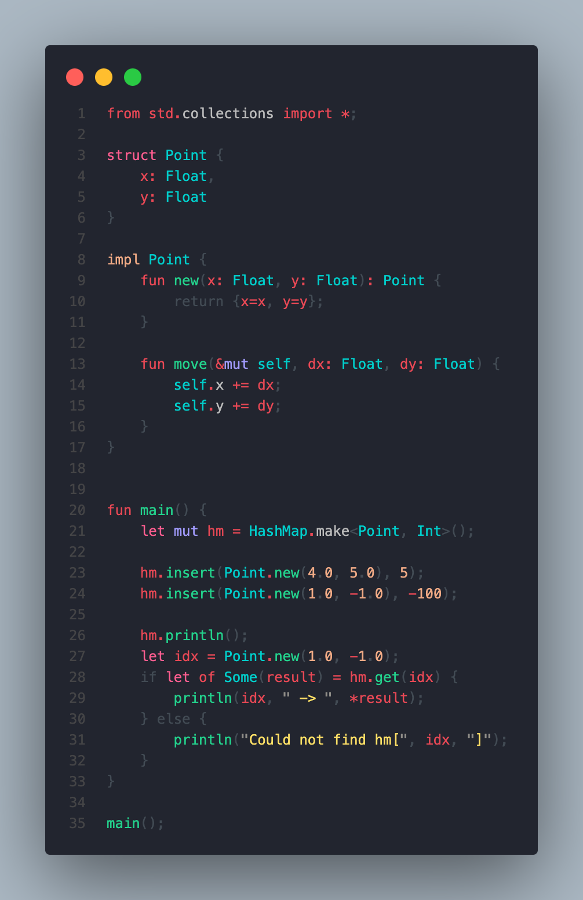
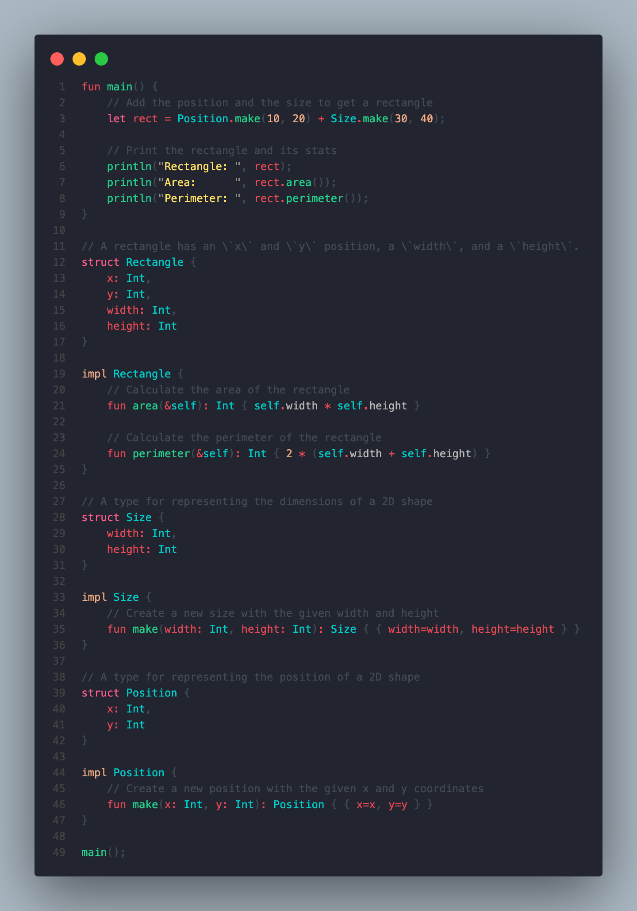
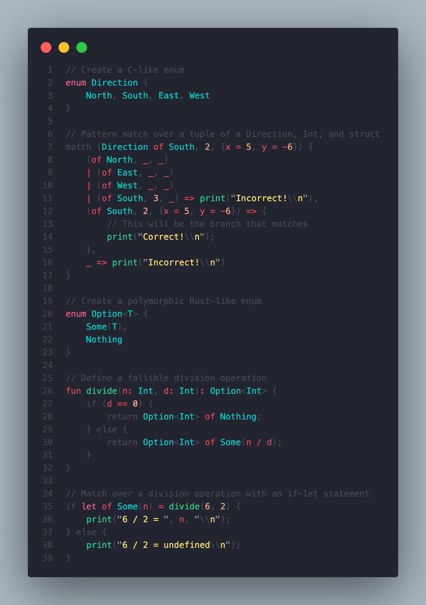

<div align="center">
  <h1>🌿🌱<b>The Sage Programming Language</b>🪴🍃</h1>
  <p>
    <strong>Sage advice for your coding conundrums!</strong>
  </p>
  <p float="left">
    <a href="https://adam-mcdaniel.net/sage-website"></a>
  </p>
  <p>
    <a href="https://adam-mcdaniel.github.io/sage-website/playgrounds/playground/"><b><i>Use the online compiler playground!</i></b></a>
    | <a href="https://discord.gg/rSGkM4bcdP"><b><i>Join the Discord server!</i></b></a>
    | <a href="https://www.youtube.com/watch?v=QdnxjYj1pS0"><b><i>Check out a video covering Sage!</i></b></a>
  </p>
  <!-- [***Here's a link to the online compiler playground!***](https://adam-mcdaniel.net/sage)
  [***Here's a link to the online compiler playground!***](https://adam-mcdaniel.net/sage) -->
</div>


## Table of Contents

- [Community](#community)
- [What is Sage?](#what-is-sage)
- [Why Sage?](#why-sage)
- [How useful is Sage?](#how-useful-is-sage)
- [How do I use Sage?](#how-do-i-use-sage)
- [What does Sage look like?](#what-does-sage-look-like)
- [Feature Roadmap](#feature-roadmap)
- [Where can I learn more?](#where-can-i-learn-more)
- [How do I contribute?](#how-do-i-contribute)
- [About the Author](#about-the-author)

## Community

Join the [Discord server](https://discord.gg/rSGkM4bcdP) to chat about Sage! Let us know if you have any thoughts or comments about the language!

## What is Sage?

Sage is a programming language that tries to be maximally portable, expressive, and intuitive. It borrows some aspects of Rust, C, and Python. It currently has an x86 compiler backend, a C source backend, and a VM interpreter backend [which can run on the web](https://adam-mcdaniel.github.io/sage-website/playgrounds/playground/).

<div align="center">
  <p float="left">
    
    
    
  </p>
</div>

Sage is licensed under the [MIT License](LICENSE), and has been under development since April 2022.

## Why Sage?

Sage is very portable -- run it on your thermostat! Here's the complete list of core virtual machine instructions and their C equivalents:

| Instruction | C Equivalent    |
| ----------- | --------------- |
| `while`     | `while (reg[0]) {` |
| `if`        | `if (reg[0]) {`    |
| `else`      | `} else {`      |
| `end`       | `}`             |
| `set N_0, N_1, ..., N_X`     | `reg[0] = N_0; reg[1] = N_1; ... reg[x] = N_X;` |
| `call`      | `funs[reg[0]]();`  |
| `ret`       | `return;`       |
| `load N`    | `memcpy(reg, tape_ptr, N * sizeof(cell));` |
| `store N`   | `memcpy(tape_ptr, reg, N * sizeof(cell));` |
| `move N`    | `tape_ptr += N;`   |
| `where`     | `reg[0].p = tape_ptr;`   |
| `deref`     | `push(tape_ptr); tape_ptr = *tape_ptr;` |
| `refer`     | `tape_ptr = pop();` |
| `index N`   | `for (int i=0; i<N; i++) reg[i].p += tape_ptr->i;` |
| `offset O, N` | `for (int i=0; i<N; i++) reg[i].p += O;` |
| `swap N` | `for (int i=0; i<N; i++) swap(reg + i, tape_ptr + i);` |
| `add N` | `for (int i=0; i<N; i++) reg[i].i += tape_ptr[i].i;` |
| `sub N` | `for (int i=0; i<N; i++) reg[i].i -= tape_ptr[i].i;` |
| `mul N` | `for (int i=0; i<N; i++) reg[i].i *= tape_ptr[i].i;` |
| `div N` | `for (int i=0; i<N; i++) reg[i].i /= tape_ptr[i].i;` |
| `rem N` | `for (int i=0; i<N; i++) reg[i].i %= tape_ptr[i].i;` |
| `or N` | `for (int i=0; i<N; i++) reg[i].i \|\|= tape_ptr[i].i;` |
| `and N` | `for (int i=0; i<N; i++) reg[i].i &&= tape_ptr[i].i;` |
| `not N` | `for (int i=0; i<N; i++) reg[i].i = !reg[i].i;` |
| `bitand N` | `for (int i=0; i<N; i++) reg[i].i &= tape_ptr[i].i;` |
| `bitor N` | `for (int i=0; i<N; i++) reg[i].i \|= tape_ptr[i].i;` |
| `bitxor N` | `for (int i=0; i<N; i++) reg[i].i ^= tape_ptr[i].i;` |
| `lsh N` | `for (int i=0; i<N; i++) reg[i].i <<= tape_ptr[i].i;` |
| `l-rsh N` | `for (int i=0; i<N; i++) reg[i].i = (uint64_t)reg[i].i >> tape_ptr[i].i;` |
| `a-rsh N` | `for (int i=0; i<N; i++) reg[i].i >>= tape_ptr[i].i;` |
| `gez N` | `for (int i=0; i<N; i++) reg[i].i = reg[i].i >= 0;` |

The compiler can target this limited "core" instruction set, with an expanded "standard" instruction set for floating point operations and foreign functions. The core instruction set is designed to be as simple as possible for anyone to implement their own backend. [Try to see if you can implement it yourself for your backend of choice!](https://github.com/adam-mcdaniel/sage/blob/main/src/targets/c.rs)

The virtual machine has some important optimization properties: Although Sage's VM is a *very simple* zero-address-code representation, it preserves all the information to *reconstruct* an LLVM-like three-address-code representation of the original higher level IR. This makes the instruction set capable of applying LLVM's optimizations while being *much easier* to implement. **Sage's innovation is in the backend, not the frontend.**

This combination of simplicity and capacity for optimization was my motivation for creating Sage. I wanted to create a virtual machine with the largest **speed + expression + portability** to **implementation difficulty** ratio, and a high level language that could compile to it. I think Sage is a good solution to this problem.

This project is based on some ideas I had while working on [Harbor](https://github.com/adam-mcdaniel/harbor) for a hackathon.

## How useful is Sage?

Sage is a very young project, and is not ready for production. It's still possible to write very useful programs in it, though.

[SageOS is an operating system with a userspace written in Sage.](https://github.com/adam-mcdaniel/sage-os) Its graphical shell and presentation app (both written in Sage) use the FFI to draw to the screen, receive input from the mouse and keyboard, interact with the filesystem, and schedule new processes. [You can look at the shell code here.](https://github.com/adam-mcdaniel/sage/tree/main/examples/sage-os/shell.sg)

[](https://github.com/adam-mcdaniel/sage-os)
[](https://github.com/adam-mcdaniel/sage-os)

The presentation app parses PPM image files from the filesystem and renders them to the screen. [You can look at the presentation code here.](https://github.com/adam-mcdaniel/sage/tree/main/examples/sage-os/presentation.sg)

[](https://github.com/adam-mcdaniel/sage-os)

Sage's foreign function interface is simple and can directly call C functions or backend-specific builtins. Check out the [web-demo](https://adam-mcdaniel.net/sage)'s foreign function interface example that calls some JavaScript code to draw graphics or alert the user!

## How do I use Sage?

To start using sage, install it with cargo:

```bash
$ cargo install --git https://github.com/adam-mcdaniel/sage
```

Then, you can run a sage file with the `sage` command:

```bash
$ sage examples/frontend/interactive-calculator.sg
```

You can also compile a sage file to C with the `--target` flag:

```bash
$ sage examples/frontend/interactive-calculator.sg --target c
$ # Or `-t c` for short
$ sage examples/frontend/interactive-calculator.sg -tc
$ gcc out.c -o out
$ ./out
```

Check out the [code for the web-demo](https://github.com/adam-mcdaniel/sage/tree/main/examples/web) to see how to use Sage in a web page.

## What does Sage look like?

Here's an example using the `collections` submodule of Sage's builtin `std` module!
The example uses a custom struct `Point` as the key for a `HashMap` instance.

```rs
from std.collections import *;

struct Point {
    x: Float,
    y: Float
}

impl Point {
    fun new(x: Float, y: Float): Point {
        return {x=x, y=y};
    }

    fun move(&mut self, dx: Float, dy: Float) {
        self.x += dx;
        self.y += dy;
    }
}


fun main() {
    let mut hm = HashMap.make<Point, Int>();

    hm.insert(Point.new(4.0, 5.0), 5);
    hm.insert(Point.new(1.0, -1.0), -100);

    hm.println();
    let idx = Point.new(1.0, -1.0);
    if let of Some(result) = hm.get(idx) {
        println(idx, " -> ", *result);
    } else {
        println("Could not find hm[", idx, "]");
    }
}

main();
```

Here's an example of Sage's structural typing: a `Rectangle` can be created by concatenating the fields of a `Position` and a `Size`!

```rs
fun main() {
    // Add the position and the size to get a rectangle
    let rect = Position.make(10, 20) + Size.make(30, 40);

    // Print the rectangle and its stats
    println("Rectangle: ", rect);
    println("Area:      ", rect.area()); 
    println("Perimeter: ", rect.perimeter());
}

// A rectangle has an \`x\` and \`y\` position, a \`width\`, and a \`height\`.
struct Rectangle {
    x: Int,
    y: Int,
    width: Int,
    height: Int
}

impl Rectangle {
    // Calculate the area of the rectangle
    fun area(&self): Int { self.width * self.height }

    // Calculate the perimeter of the rectangle
    fun perimeter(&self): Int { 2 * (self.width + self.height) }
}

// A type for representing the dimensions of a 2D shape
struct Size {
    width: Int,
    height: Int
}

impl Size {
    // Create a new size with the given width and height
    fun make(width: Int, height: Int): Size { { width=width, height=height } }
}

// A type for representing the position of a 2D shape
struct Position {
    x: Int,
    y: Int
}

impl Position {
    // Create a new position with the given x and y coordinates
    fun make(x: Int, y: Int): Position { { x=x, y=y } }
}

main();
```

Here's an example of Sage's pattern matching: it's easy to deconstruct a value using `match`, `if let`, or a simple `let` binding. Sage's `match` expressions are very powerful!

```rs
// Create a C-like enum
enum Direction {
    North, South, East, West
}

// Pattern match over a tuple of a Direction, Int, and struct
match (Direction of South, 2, {x = 5, y = -6}) {
    (of North, _, _)
    | (of East, _, _)
    | (of West, _, _)
    | (of South, 3, _) => print("Incorrect!\\n"),
    (of South, 2, {x = 5, y = -6}) => {
        // This will be the branch that matches
        print("Correct!\\n");
    },
    _ => print("Incorrect!\\n")
}

// Create a polymorphic Rust-like enum
enum Option<T> {
    Some(T),
    Nothing
}

// Define a fallible division operation
fun divide(n: Int, d: Int): Option<Int> {
    if (d == 0) {
        return Option<Int> of Nothing;
    } else {
        return Option<Int> of Some(n / d);
    }
}

// Match over a division operation with an if-let statement
if let of Some(n) = divide(6, 2) {
    print("6 / 2 = ", n, "\\n");
} else {
    print("6 / 2 = undefined\\n");
}
```

Go to the [web-demo](https://adam-mcdaniel.github.io/sage-website/playgrounds/playground/) or the [examples/frontend](https://github.com/adam-mcdaniel/sage/tree/main/examples/frontend) folder to see more code examples.

## Feature Roadmap

- [x] Compiler Backends
  - [ ] LLVM (highly desired!)
  - [x] C (fully-implemented but unoptimized)
  - [x] Interpreter (fully-implemented but unoptimized)
  - [x] Web Backend
    - [x] Interpreter
    - [ ] Visual demo like the [web-demo](https://adam-mcdaniel.net/harbor) for [Harbor](https://github.com/adam-mcdaniel/harbor)
- [x] SIMD vector instruction support
- [x] Static variables and constant expressions
- [x] Conditional compilation
- [x] Polymorphic functions
- [x] Mutability checks
- [x] Rust-like `enum`s
- [x] Pattern `match`ing
- [x] Structural typing
- [x] Associated constants and methods
- [x] Recursive polymorphic types
- [ ] Iterators and list/vector/array comprehensions
- [ ] Hindley-Milner type inference
- [ ] VSCode extension (syntax highlighting, code completion, etc.)
- [ ] Typeclasses
- [ ] `no-std` implementation of compiler
- [x] `const` generics
- [x] Modules
- [x] A standard library
  - [ ] Type Reflection Module
  - [x] Collections Module
  - [ ] Networking Module
  - [ ] Filesystem Module
  - [ ] Graphics Module
  - [ ] Audio Module
  - [ ] GUI Module
  - [ ] WebAssembly Module
  - [ ] Foreign Function Interface Module (create backend with `.toml` file)
  - [x] Memory Management Module
- [x] Better frontend parser (switch to [Nom](https://crates.io/crates/nom)?)
- [ ] A package manager
- [x] AST Macros
- [ ] C frontend (compile C to Sage VM)
- [ ] Self-hosting implementation

## Where can I learn more?

You can read [my blog post](https://adam-mcdaniel.github.io/blog/compilers-for-the-future) (~20 minute read) about the programming language to learn more about the implementation!

[Here's a 23 minute YouTube video that covers how compilers work, and delves into Sage!](https://www.youtube.com/watch?v=QdnxjYj1pS0)

Join the [Discord server](https://discord.gg/rSGkM4bcdP) to chat about Sage!

## How do I contribute?

If you want to contribute, you can open an issue or a pull request. [Adding backends for other architectures is a great way to contribute!](https://github.com/adam-mcdaniel/sage/blob/main/src/targets/c.rs) We also need a VSCode syntax highlighting extension!

## About the Author

[I'm a computer science PhD student](https://adam-mcdaniel.net) at the [University of Tennessee, Knoxville🍊](https://www.youtube.com/watch?v=-8MlEo02u54). Rust is my favorite language, and [I've](https://github.com/adam-mcdaniel/oakc) [written](https://github.com/adam-mcdaniel/harbor) [many](https://github.com/adam-mcdaniel/tsar) [other](https://github.com/adam-mcdaniel/free) [compilers](https://github.com/adam-mcdaniel/xasm). This is the last project I started as a teenager, and I was the only author to touch any of the code up to version `v0.0.2-alpha` (12/25/2023)! I'm looking for work opportunities for Summer 2024 (after I finish my Masters degree), so if you're interested in hiring me, please reach out to me at [amcdan23@vols.utk.edu](mailto:amcdan23@vols.utk.edu)!
