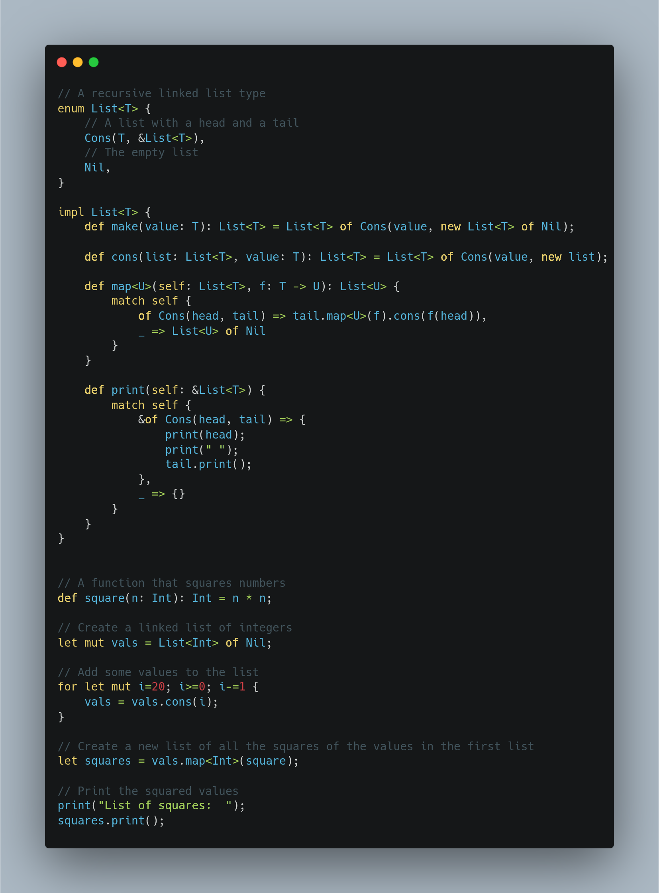
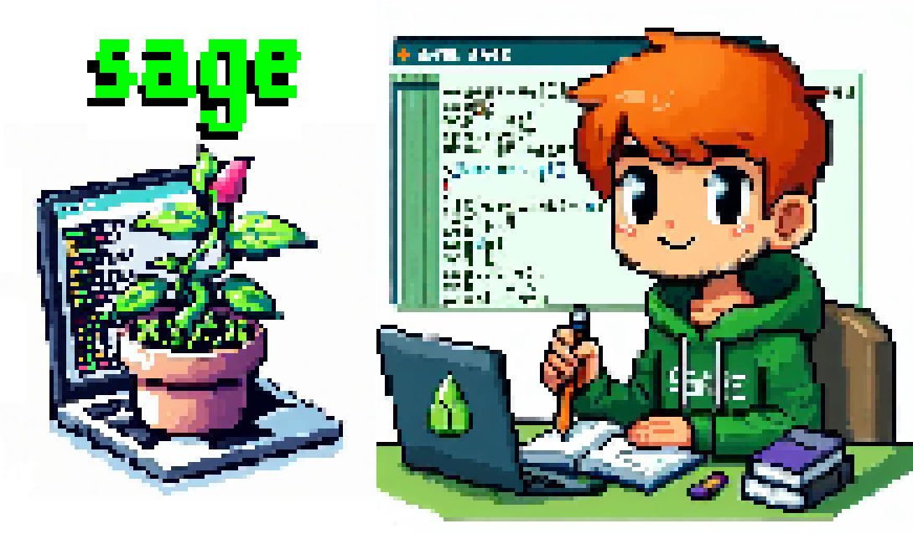
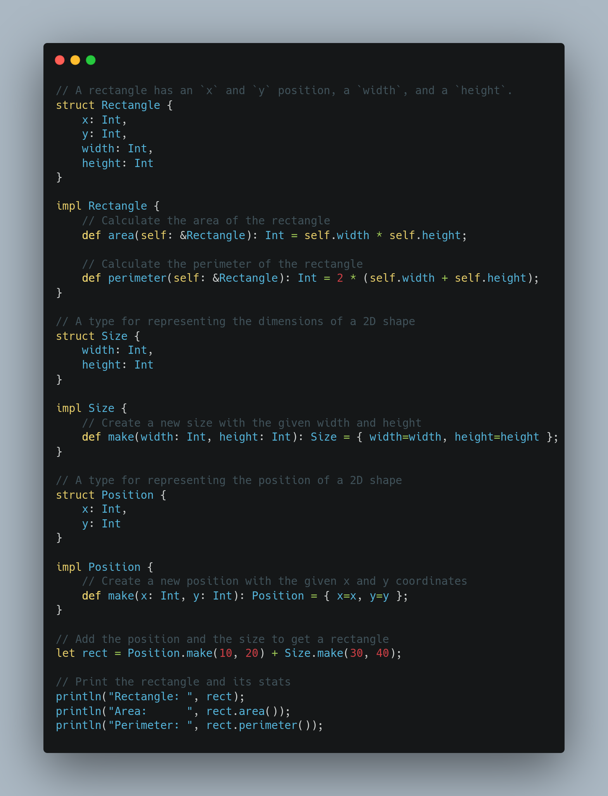
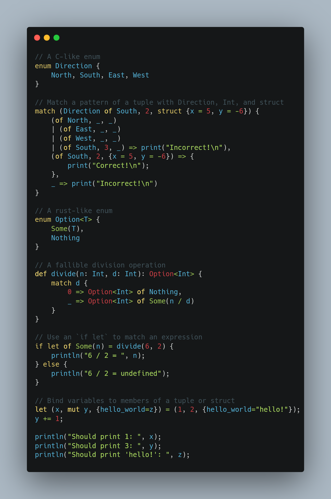
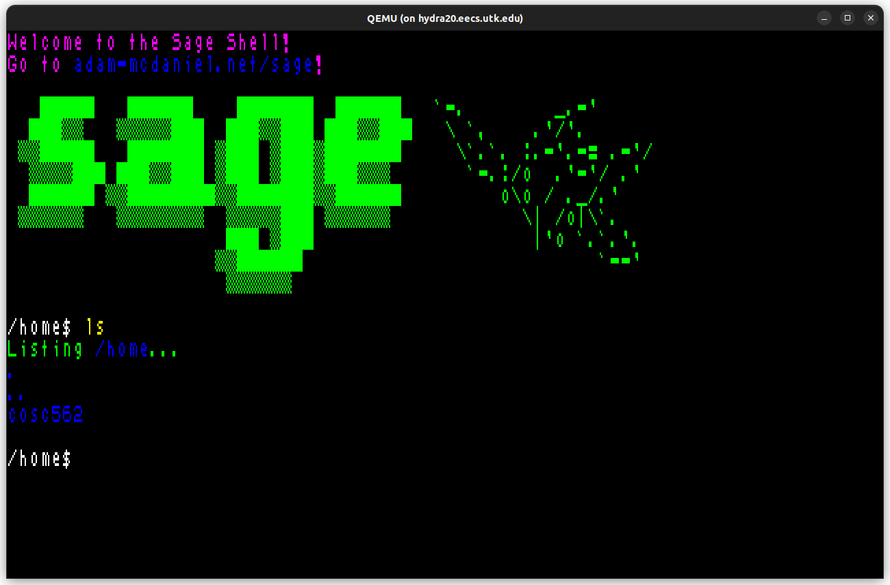
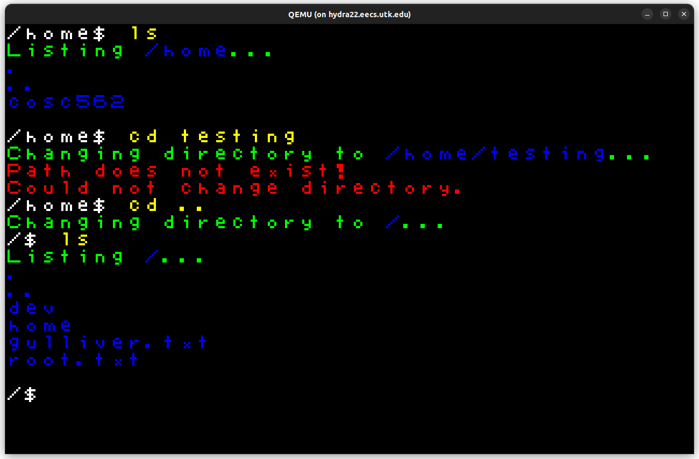
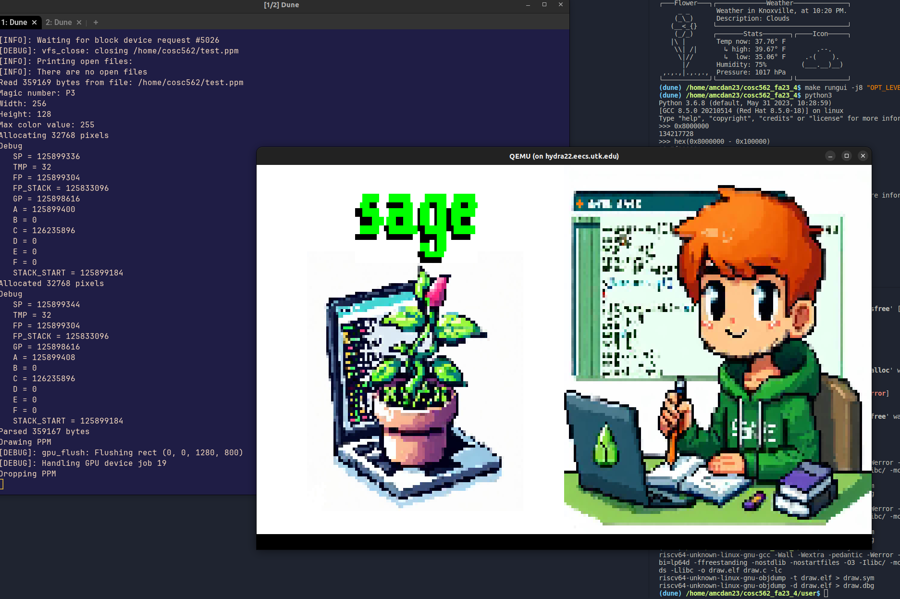

<div align="center">
  <h1>🌿🌱<b>The Sage Programming Language</b>🪴🍃</h1>
  <p>
    <strong>Sage advice for your coding conundrums!</strong>
  </p>
  <p float="left">
    
    <a href="https://adam-mcdaniel.net/sage"></a>
  </p>
</div>

[***Here's a link to the online compiler playground!***](https://adam-mcdaniel.net/sage)

## Table of Contents

- [Community](#community)
- [What is Sage?](#what-is-sage)
- [Why Sage?](#why-sage)
- [How useful is Sage?](#how-useful-is-sage)
- [How do I use Sage?](#how-do-i-use-sage)
- [What does Sage look like?](#what-does-sage-look-like)
- [Feature Roadmap](#feature-roadmap)
- [Where can I learn more?](#where-can-i-learn-more)
- [How do I contribute?](#how-do-i-contribute)
- [About the Author](#about-the-author)

## Community

Join the [Discord server](https://discord.gg/rSGkM4bcdP) to chat about Sage! Let us know if you have any thoughts or comments about the language!

## What is Sage?

Sage is a programming language that tries to be maximally portable, expressive, and intuitive. It borrows some aspects of Rust, C, and Python. It currently has an x86 compiler backend, a C source backend, and a VM interpreter backend [which can run on the web](https://adam-mcdaniel.net/sage).

<div align="center">
  <p float="left">
    
    
    
  </p>
</div>

Sage is licensed under the [MIT License](LICENSE), and has been under development since April 2022.

## Why Sage?

Sage is very portable -- run it on your thermostat! Here's the complete list of core virtual machine instructions and their C equivalents:

| Instruction | C Equivalent    |
| ----------- | --------------- |
| `while`     | `while (reg) {` |
| `if`        | `if (reg) {`    |
| `else`      | `} else {`      |
| `end`       | `}`             |
| `set N`     | `reg = N;`      |
| `call`      | `funs[reg]();`  |
| `ret`       | `return;`       |
| `save`      | `*tape_ptr = reg;` |
| `res`       | `reg = *tape_ptr;` |
| `move N`    | `tape_ptr += N;`   |
| `where`     | `reg = tape_ptr;`   |
| `deref`     | `push(tape_ptr); tape_ptr = *tape_ptr;` |
| `refer`     | `tape_ptr = pop();` |
| `index`     | `reg = (cell*)(reg) + *tape_ptr;`    |
| `add`       | `reg += *tape_ptr;` |
| `sub`       | `reg -= *tape_ptr;` |
| `mul`       | `reg *= *tape_ptr;` |
| `div`       | `reg /= *tape_ptr;` |
| `rem`       | `reg %= *tape_ptr;` |
| `gez`       | `reg = reg >= 0;`  |

You could fit this instruction set on a T-shirt!

The compiler can target this limited "core" instruction set, with an expanded "standard" instruction set for floating point operations and foreign functions. The core instruction set is designed to be as simple as possible for anyone to implement their own backend. [Try to see if you can implement it yourself for your backend of choice!](https://github.com/adam-mcdaniel/sage/blob/main/src/targets/c.rs)

The instruction set is a "zero address code" IR, unlike the popular ["three address code"](https://en.wikipedia.org/wiki/Three-address_code) LLVM IR, but it's still possible to apply single static assignment to it. Sage preserves all the information to *reconstruct* a three address code representation of the original compiled IR from the *very simple* zero address code representation, **but it's significantly easier to write a compiler or interpreter for the zero address code**. This makes the instruction set capable of applying LLVM's optimizations while being easy to implement.

This project is based on some ideas I had while working on [Harbor](https://github.com/adam-mcdaniel/harbor) for a hackathon.

## How useful is Sage?

Sage is a very young project, and is not ready for production. It's still possible to write very useful programs in it, though.

[SageOS is an operating system with a userspace written in Sage.](https://github.com/adam-mcdaniel/sage-os) Its graphical shell and presentation app (both written in Sage) use the FFI to draw to the screen, receive input from the mouse and keyboard, interact with the filesystem, and schedule new processes. [You can look at the shell code here.](https://github.com/adam-mcdaniel/sage/tree/main/examples/sage-os/shell.sg)

[](https://github.com/adam-mcdaniel/sage-os)
[](https://github.com/adam-mcdaniel/sage-os)

The presentation app parses PPM image files from the filesystem and renders them to the screen. [You can look at the presentation code here.](https://github.com/adam-mcdaniel/sage/tree/main/examples/sage-os/presentation.sg)

[](https://github.com/adam-mcdaniel/sage-os)

Sage's FFI is simple and can directly call C functions or backend-specific builtins. Check out the [web-demo](https://adam-mcdaniel.net/sage)'s FFI example that calls some JavaScript code to draw graphics or alert the user!

## How do I use Sage?

To start using sage, install it with cargo:

```bash
$ cargo install --git https://github.com/adam-mcdaniel/sage
```

Then, you can run a sage file with the `sage` command:

```bash
$ sage examples/frontend/interactive-calculator.sg
```

You can also compile a sage file to C with the `--target` flag:

```bash
$ sage examples/frontend/interactive-calculator.sg --target c
$ # Or `-t c` for short
$ sage examples/frontend/interactive-calculator.sg -tc
$ gcc out.c -o out
$ ./out
```

Check out the [code for the web-demo](https://github.com/adam-mcdaniel/sage/tree/main/examples/web) to see how to use Sage in a web page.

## What does Sage look like?

Here's an example of a polymorphic linked list in Sage using Rust-like `enum`s! It's straightforward to implement operations like `map` with just a few lines.


<div align="center">
    
</div>


Here's an example of Sage's structural typing: a `Rectangle` can be created by concatenating the fields of a `Position` and a `Size`!


<div align="center">
  
</div>


Here's an example of Sage's pattern matching: it's easy to deconstruct a value using `match`, `if let`, or a simple `let` binding. Sage's `match` expressions are very powerful!


<div align="center">
  
</div>


Go to the [web-demo](https://adam-mcdaniel.net/sage) or the [examples/frontend](https://github.com/adam-mcdaniel/sage/tree/main/examples/frontend) folder to see more code examples.

## Feature Roadmap

- [x] Compiler Backends
  - [x] x86 (semi-implemented and unoptimized)
  - [ ] RISC-V
  - [ ] ARM
  - [ ] LLVM (highly desired!)
  - [x] C (fully-implemented but unoptimized)
  - [x] Interpreter (fully-implemented but unoptimized)
  - [x] Web Backend
    - [x] Interpreter
    - [ ] Visual demo like the [web-demo](https://adam-mcdaniel.net/harbor) for [Harbor](https://github.com/adam-mcdaniel/harbor)
- [x] Static variables and constant expressions
- [x] Conditional compilation
- [x] Polymorphic functions
- [x] Mutability checks
- [x] Rust-like `enum`s
- [x] Pattern `match`ing
- [x] Structural typing
- [x] Associated constants and methods
- [x] Recursive polymorphic types
- [ ] Iterators and list/vector/array comprehensions
- [ ] Hindley-Milner type inference
- [ ] VSCode extension (syntax highlighting, code completion, etc.)
- [ ] Typeclasses
- [ ] `no-std` implementation of compiler
- [ ] Modules
- [ ] A standard library
  - [ ] Type Reflection Module
  - [ ] Collections Module
  - [ ] Networking Module
  - [ ] Filesystem Module
  - [ ] Graphics Module
  - [ ] Audio Module
  - [ ] GUI Module
  - [ ] WebAssembly Module
  - [ ] Foreign Function Interface Module (create backend with `.toml` file)
  - [ ] Memory Management Module
- [ ] Better frontend parser (switch to [Nom](https://crates.io/crates/nom)?)
- [ ] A package manager
- [ ] AST Macros
- [ ] C frontend (compile C to Sage VM)
- [ ] Self-hosting implementation

## Where can I learn more?

You can read [my blog post](https://adam-mcdaniel-blog.github.io/compilers-for-the-future) (~20 minute read) about the programming language to learn more about the implementation!

Join the [Discord server](https://discord.gg/rSGkM4bcdP) to chat about Sage!

## How do I contribute?

If you want to contribute, you can open an issue or a pull request. [Adding backends for other architectures is a great way to contribute!](https://github.com/adam-mcdaniel/sage/blob/main/src/targets/c.rs) We also need a VSCode syntax highlighting extension!

## About the Author

[I'm a 21 year old computer science graduate student](https://adam-mcdaniel.net) at the [University of Tennessee, Knoxville🍊](https://www.youtube.com/watch?v=-8MlEo02u54). Rust is my favorite language, and [I've](https://github.com/adam-mcdaniel/oakc) [written](https://github.com/adam-mcdaniel/harbor) [many](https://github.com/adam-mcdaniel/tsar) [other](https://github.com/adam-mcdaniel/free) [compilers](https://github.com/adam-mcdaniel/xasm). This is the last project I started as a teenager, and I was the only author to touch any of the code up to version `v0.0.2-alpha` (12/25/2023)! I'm looking for work opportunities for Summer 2024 (after I finish my Masters degree), so if you're interested in hiring me, please reach out to me at [amcdan23@vols.utk.edu](mailto:amcdan23@vols.utk.edu)!
